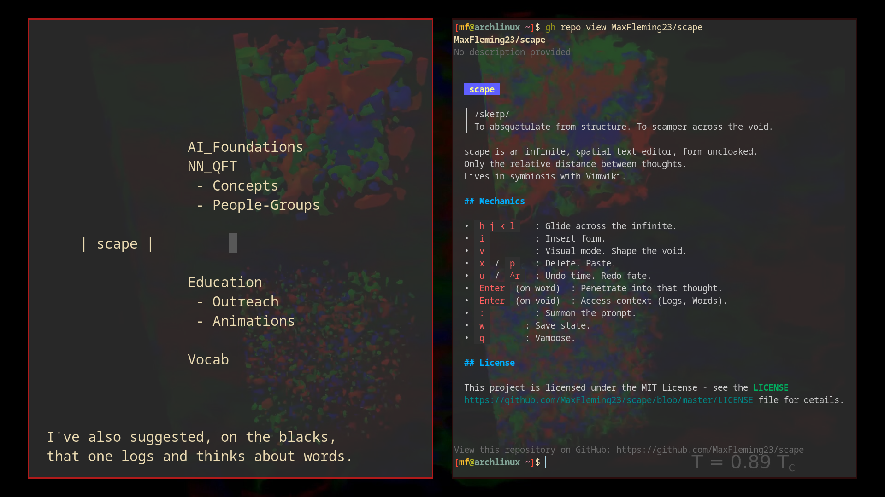

# scape

> /skeɪp/
> To absquatulate from structure. To scamper across the void.

scape is an infinite, spatial text editor, form uncloaked.
Only the relative distance between thoughts.
Lives in symbiosis with Vimwiki.

## Mechanics

- `h j k l`   : Glide across the infinite.
- `i`         : Insert form.
- `v`         : Visual mode. Shape the void.
- `x` / `p`   : Delete. Paste.
- `u` / `^r`  : Undo time. Redo fate.

- `Enter` (on word)  : Penetrate into that thought.
- `Enter` (on void)  : Access context (Logs, Words).

- `:`         : Summon the prompt.
- `w`       : Save state.
- `q`       : Vamoose.

## License

This project is licensed under the MIT License - see the [LICENSE](LICENSE) file for details.